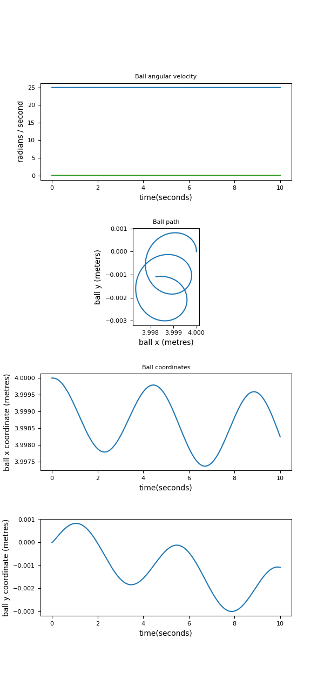

# Ball on turntable - simulation

Simulation using [MuJoCo](https://github.com/deepmind/dm_control)

https://user-images.githubusercontent.com/3136161/218303241-f2602480-ecdd-48eb-aefb-87770037f9f4.mp4

There are three simulations

## 1) Ball at steady state

The ball tangential velocity matches the turntable velocity at the point of contact.  The ball approximately stays exactly on the same spot.

https://user-images.githubusercontent.com/3136161/218303469-e0f936f0-4b0d-46c0-b11a-be0e16e5e297.mp4

## 2) Ball in orbit around steady state location

(For video, see top of this page.)

## 3) Many balls, sharing the same orbit (approximately)

https://user-images.githubusercontent.com/3136161/218303878-9cd7bccd-a0a8-4c28-8b07-303d8f7d0900.mp4

